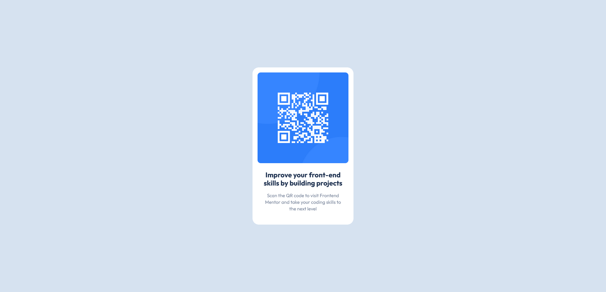

# Frontend Mentor - QR code component solution

This is a solution to the [QR code component challenge on Frontend Mentor](https://www.frontendmentor.io/challenges/qr-code-component-iux_sIO_H). Frontend Mentor challenges help you improve your coding skills by building realistic projects. 

### Links

- [Solution](https://www.frontendmentor.io/solutions/qr-code-component-sass-bem-flexbox-css-custom-properties-R-vffA82ZF)
- [Live Site](https://bjoerndeppisch-fem-qr-code-component.netlify.app/)

### Built with

- Semantic HTML5 markup
- CSS Custom Properties
- Flexbox
- Sass
- BEM Naming

## Author

- Frontend Mentor - [@bjoerndeppisch](https://www.frontendmentor.io/profile/bjoerndeppisch)
- Twitter - [@bjoerndeppisch](https://twitter.com/bjoerndeppisch)

